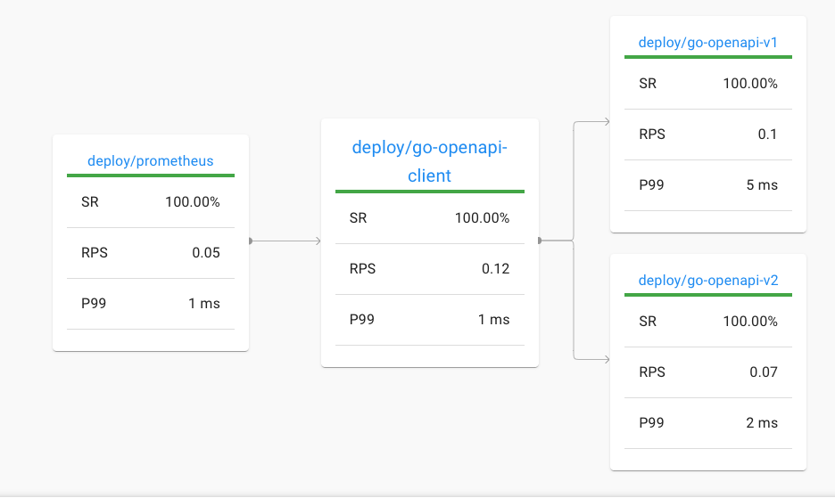

## Traffic splitting demo





### Reproduce


kind create cluster --image rossgeorgiev/kind-node-arm64:v1.20.0
linkerd install | kubectl apply -f -
linkerd viz install | kubectl apply -f -


```
#go-openapi-v2
definitions:
  User:
    type: "object"
    required:
      - foodPreference
    properties:
      id:
        type: "integer"
        format: "int64"
      username:
        type: "string"
      firstName:
        type: "string"
      lastName:
        type: "string"
      foodPreference:
        type: "string"
```

```
curl -X POST "http://localhost:8080/v2/user" -H  "accept: application/xml" -H  "Content-Type: application/json" -d "{  \"email\": \"string\",  \"firstName\": \"string\",  \"id\": 0,  \"lastName\": \"string\",  \"password\": \"string\",  \"phone\": \"string\",  \"userStatus\": 0,  \"username\": \"alex\"}"
{"code":602,"message":"foodPreference in body is required"}%
```


- `kubectl create ns apps`
- `kubectl annotate ns apps "linkerd.io/inject=enabled"`


_deploy_

```
./deploy_with_helm.sh
```

```
❯ k get pods -n apps
NAME                             READY   STATUS            RESTARTS   AGE
go-openapi-v1-549c9cb676-vx69x   0/2     PodInitializing   0          17s
go-openapi-v2-7bb874cf5b-2hppq   0/2     PodInitializing   0          13s
```

```
❯ linkerd -n apps viz stat deploy
NAME            MESHED   SUCCESS      RPS   LATENCY_P50   LATENCY_P95   LATENCY_P99   TCP_CONN
go-openapi-v1      1/1   100.00%   0.5rps           1ms           1ms           1ms          2
go-openapi-v2      1/1   100.00%   0.5rps           1ms           1ms           1ms          2
```
